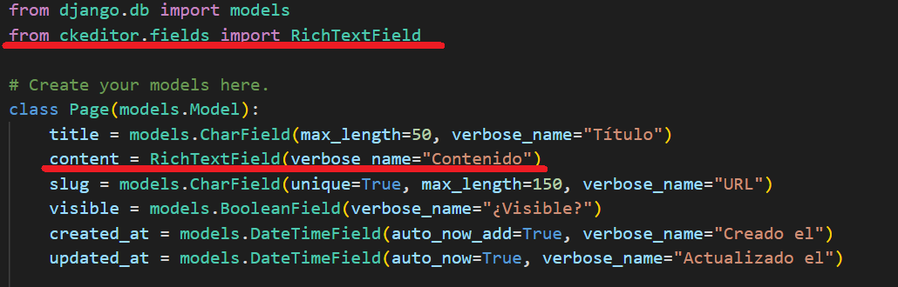

## Crear migraciones y tablas

[Regresar](/CodingBootcampsESPOL-RDDW/)

* Vamos a generar las migraciones para la base de datos. Abre la terminal en la carpeta ProyectoDjango y ejecuta el siguiente comando. 

```
python manage.py makemigrations
```

<p align="center">

</p>

* Ahora ejecuta el siguiente comando en la consola, esto permite crear el fichero sql.

```
python manage.py sqlmigrate pages 0001
```
<p align="center">

</p>

* La ejecución de las migraciones en la base de datos se hacen utilizando el siguiente comando:

```
python manage.py migrate
```

* Ejecutamos el servidor.

```
python manage.py runserver
```
* En el editor de texto en este caso Visual Studio Code daremos clic derecho en el archivo db.sqlite3(RDDD-apps>django>ProyectoDjango>db.sqlite3) y escogeremos la opción de "Reveal in File Explorer". Luego, abres el programa **DB Browser for SQLite**  y arrastras el archivo db.sqlite3 al programa. 

<p align="center">

</p>

Configurar el panel de administración en Django
===========

* * *

* Iniciaremos creando un usuario para el panel de administración ejecutando el siguiente comando en la terminal. Asignas el nombre, dirección electrónico y contraseña. 

```
python manage.py createsuperuser
```

* Ejecuta el servidor y accedes en tu navegador a la página del [panel de administración](http://127.0.0.1:8000/admin/) en la que iniciarás sesión con tu usuario y contraseña definida anteriormente. 

<p align="center">

</p>

* En el panel de administración por defecto se encuentran las configuraciones básicas. Sin embargo, agregaremos nuestro modelo al panel, abre el archivo admin.py(RDDD-apps>django>ProyectoDjango>pages>admin.py)

```py
from .models import Page
# Register your models here.
admin.site.register(Page)
```

<p align="center">

</p>

* Modificaremos el nombre de la app así que inserta el siguiente cambio en el archivo apps.py.(RDDD-apps>django>ProyectoDjango>pages>apps.py)

```py
verbose_name = "Gestión de páginas"
```
* Por la configuración anterior debes modificar el elemento pages que se encuentra en el array INSTALLED_APPS del archivo setting.py. (RDDD-apps>django>ProyectoDjango>ProyectoDjango>settings.py)

```py
'pages.apps.PagesConfig'
```

* Continuamos modificando el título y subtítulo del panel de administración. Accede al archivo de admin.py.

```py
title = "Proyecto con Django"
subtitle = "Panel de gestión"
admin.site.site_header = title
admin.site.site_title = title
admin.site.index_title = subtitle
```

* Actualiza la página del [panel de administración](http://127.0.0.1:8000/admin/) y notarás los cambios.

<p align="center">

</p>

Menú dinámico y context processors
===========

* * *

* Añadimos nuevas páginas mediante el [panel de administración](http://127.0.0.1:8000/admin/pages/page/add/) y damos clic en Guardar.

<p align="center">

</p>


<p align="center">

</p>

<p align="center">

</p>

Las páginas antes creadas las añadiremos al panel de navegación mediante el context processors, que es un conjunto de procesadores de solicitudes que devuelven diccionarios para fusionarlos en un 
contexto de plantilla. Cada función toma el objeto de solicitud como su único parámetro 
y devuelve un diccionario para agregar al contexto.

* En la carpeta **pages** (RDDD-apps>django>ProyectoDjango>pages) crear el archivo context_processors.py.

```py
from pages.models import Page

def get_pages(request):
    pages = Page.objects.values_list('id', 'title', 'slug')
    return{
        'pages' : pages 
    }
```
* Es momento de cargar nuestro context_processors en el array del context_processors del archivo settings.py(RDDD-apps>django>ProyectoDjango>ProyectoDjango>settings.py)

<p align="center">

</p>

* Utilizaremos el context_processors en la template de layout.html(RDDD-apps>django>ProyectoDjango>mainapp>templates>layouts>layout.html).

<p align="center">

</p>

<p align="center">

</p>

Crear vista y url para las páginas
===========

* * *

* Crearemos la vista que nos muestre la página, por ello modificamos el archivo views.py.(RDDD-apps>django>ProyectoDjango>pages>views.py).

```py
def page(request):
    return render(request, "pages/page.html",{
        "title" : "Página individual",
        "page" : "Hola Mundo desde la app Pages"
    })
```

* En la subcarpeta pages creamos el directorio **templates** y a su vez dentro de templates creamos la carpeta **pages** en la que se tendrá el archivo **page.html**.

<p align="center">

</p>

* En el archivo urls.py(RDDD-apps>django>ProyectoDjango>ProyectoDjango>urls.py).

<p align="center">

</p>

<p align="center">

</p>

Mostrar datos reales en las páginas
===========

* * *

* Añadimos las siguientes modificaciones al archivo views.py.

```py
from .models import Page
# Create your views here.

def page(request, slug):
    page = Page.objects.get(slug=slug)
    return render(request, "pages/page.html",{
        "page" : page
    })
```

* También realizamos un pequeño cambio en el archivo urls.py.

```py
path('pagina/<str:slug>', page_views.page, name="page")
```

* El archivo page.html tendrá la siguiente estructura. 

<p align="center">

</p>

* Arranca el servidor y accede a la [página de sobre-nosotrso](http://127.0.0.1:8000/pagina/sobre-nosotros) que fue creada desde el panel de administración.

<p align="center">

</p>

* Ahora modificaremos el archivo layout.html.(RDDD-apps>django>ProyectoDjango>mainapp>templates>layouts>layout.html)

<p align="center">

</p>

Solo mostrar páginas visibles
===========

* * *

* Recordemos que una de los atributos es el de ¿Visible? asi que por ello haremos la modificación en el context_processors para que se muestren únicamente las páginas que son visibles. Realizamos el siguiente cambio en el context_processors.py.

```py
pages = Page.objects.filter(visible=True).values_list('id', 'title', 'slug')
```

Estilos para las páginas
===========

* * *

* En el archivo page.html añadimos clases a las etiquetas para darles estilos en el archivo styles.css.

<p align="center">

</p>

* En el archivo styles.css añade las siguientes líneas de código.(RDDD-apps\django\ProyectoDjango\mainapp\static\css\styles.css)

```css
.date{
    display: block;
    margin-top: 15px;
    margin-bottom: 15px;
    color: gray;
}

.content{
    line-height: 25px;
}
```

Mejorar la configuración de rutas
===========

* * *

Las rutas las habíamos manejando importando las views en el archivo urls.py, pero esto no es favorable ya que si se crean distintas apps cada vez se tendría que importar. Por tal razón, separaremos las rutas cargados en el url.py y la añadiremos en cada app de nuestro proyecto de Django.

* En la carpeta pages(RDDD-apps\django\ProyectoDjango\pages) crear un archivo urls.py.

```py
from django.urls import path
from . import views

urlpatterns = [
    path('pagina/<str:slug>', views.page, name="page")
]
```

* En la carpeta mainapp(RDDD-apps\django\ProyectoDjango\mainapp) crear el archivo urls.py.

```py
from django.urls import path
from . import views

urlpatterns =[
    path('', views.index, name="index"),
    path('inicio/', views.index, name="inicio"),
]
```
* Ahora se eliminará y modificará ciertos paths en el archivo urls.py de la subcarpeta ProyectoDjango.(RDDD-apps\django\ProyectoDjango\ProyectoDjango\urls.py)

```py
from django.urls import path, include

urlpatterns = [
    path('admin/', admin.site.urls),
    path('', include('mainapp.urls')),
    path('', include('pages.urls')),
]
```

Editor de texto enriquecido en Django
===========

* * *

Un editor de texto enriquecido es una herramienta que permite a los usuarios crear y editar documentos formateados. Por lo general, un editor de texto enriquecido incluye varias herramientas para diseñar texto, como: cursiva y subrayado, así como para crear listas, tablas y enlaces. Utilizaremos CKEditor como editor de texto enriquecido. 

* En la consola dirigete a la carpeta **ProyectoDjango** y ejecuta el siguiente comando.

```
pip install django-ckeditor
```
* En la consola vuelve a ejecutar el servidor.

```
python manage.py runserver
```
* La app de ckeditor debe ser cargada en el archivo de settings.py(RDDD-apps\django\ProyectoDjango\ProyectoDjango\settings.py).

<p align="center">

</p>

* En la carpeta pages que es una de nuestras app se encuentra el archivo models.py(RDDD-apps\django\ProyectoDjango\pages\models.py) en la que se modificará la variable content.

<p align="center">

</p>

* Asegúrate de tener levantado el servidor y accede al panel de administración y verifica algunas de las páginas y notarás que se ha cargado el editor de texto enriquecido en la variable **contenido**.

<p align="center">

</p>

* Es importante notar que al momento de modificar y añadirles ciertos cambios a cualquiera de las páginas efectivamente se actualizan dichos cambios. Sin embargo, visulizamos mediante la págian web en donde se encuentra el menú de navegación que no reconoce las etiquetas de html.

<p align="center">

</p>

* Para que la plantilla de html lea todas las etiquetas debemos agregarle **safe** en el archivo page.html(RDDD-apps\django\ProyectoDjango\pages\templates\pages\page.html).

<p align="center">

</p>

Configuración del editor de texto enriquecido 
===========

* * *

En google encontrarás la documentación oficial de [CKEditor](https://django-ckeditor.readthedocs.io/en/latest/) en que se tienen una serie de configuraciones que puedes usar en tu proyecto de Django.

* En la archivo de settings.py(RDDD-apps\django\ProyectoDjango\ProyectoDjango\settings.py) puedes añadir la siguiente configuración.

```py
CKEDITOR_CONFIGS = {
    'default': {
        'toolbar': 'Custom',
        'toolbar_Custom': [
            ['Bold', 'Italic', 'Underline'],
            ['NumberedList', 'BulletedList', '-', 'Outdent', 'Indent', '-', 'JustifyLeft', 'JustifyCenter', 'JustifyRight', 'JustifyBlock'],
            ['Link', 'Unlink'],
            ['RemoveFormat', 'Source', 'Table', 'Image' ]
        ]
    }
}
```

* Ejecuta el servidor y si ya está ejecutado, entonces actualiza el anvegador en una de las páginas creadas en el panel de administración. 

<p align="center">

</p>