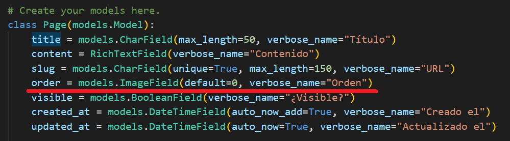
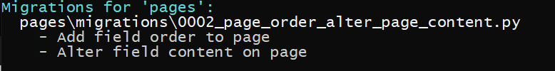
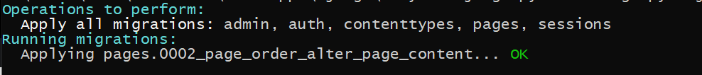
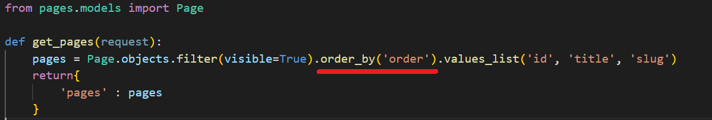
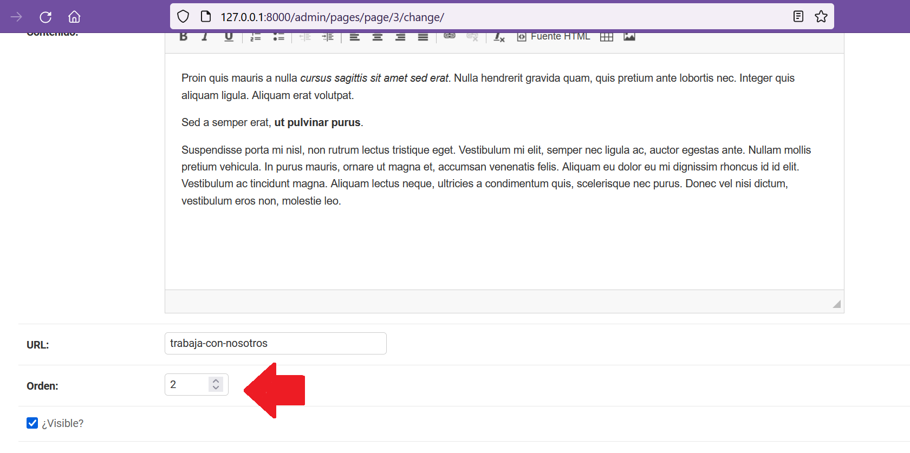

## Modificar el modelo y agregar orden de páginas

[Regresar](/CodingBootcampsESPOL-RDDW/)

En el panel de administración creamos las páginas y ya en nuestra aplicación notamos que en la barra de navegación las páginas se colocan al final, pero también podemos modificarla para agregar un orden. 

* En la subcarpeta **pages** se encuentra el archivo models.py(RDDD-apps\django\ProyectoDjango\pages\models.py) en donde realizaremos las modificaciones.

<p align="center">

</p>

* Ya ese campo no se encuentra en la base de datos, ahora es momento de hacer una migración con el comando.

```
python manage.py makemigrations
```
<p align="center">

</p>

* Ya con la migración ejecutaremos el comando para generar el código sql en la base de datos.

```
python manage.py sqlmigrate pages 0002
```

* Para efectuar todos esos cambios en la base de datos ejecutamos el siguiente comando en la terminal.

```
python manage.py migrate
```
<p align="center">

</p>

* Para añadirle el orden debemos modificar el context_processors.py.

<p align="center">

</p>

* Vuelve a ejecutar el servidor, y accede mediante el panel de administración y modifica alguna de lás páginas ya creadas dando un orden de 2 para que aprezca segundo en la barra de navegación. 

<p align="center">

</p>