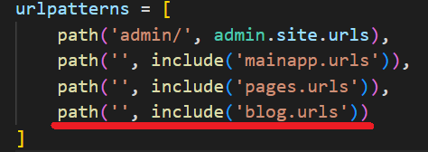

## Cargar modelos en el panel de administración

[Regresar](/CodingBootcampsESPOL-RDDW/)

Para cargar los modelos en el panel de administración trabajaremos en el archivo admin.py(RDDD-apps\django\ProyectoDjango\blog\admin.py).

```py
from .models import Category, Article
# Register your models here.
admin.site.register(Category)
admin.site.register(Article)
```
* Abrimos la consola en la carpeta ProyectoDjango(RDDD-apps\django\ProyectoDjango) y ejecutamos el servidor.

```
python manage.py runserver
```
* Si presenta algún error debes eliminar el parámetro de "null=True" en el campo categories de la clase Article.

* Abre el navegador en el panel de administración y aparecerá la app **BLOG**.

<p align="center">

</p>

* Le cambiaremos el nombre de la app blog en el panel de administración. Agregamos la siguiente configuración en el archivo app.py.(RDDD-apps\django\ProyectoDjango\blog\apps.py)

```py
verbose_name = 'Gestión del Blog'
```

* Ahora en el archivo de settings.py(RDDD-apps\django\ProyectoDjango\ProyectoDjango\settings.py)

<p align="center">

</p>

<p align="center">

</p>

* Crea una [nueva categoría](http://127.0.0.1:8000/admin/blog/category/add/).

<p align="center">

</p>

* Añadimos otro categoría.

<p align="center">

</p>

* Añadiremos la categoría de **Sistemas**.

* Ahora agregaremos código para que aparezcan los otros campos dentro de la clase de artículos. Abre el archivo admin.py(RDDD-apps\django\ProyectoDjango\blog\admin.py) y agrega lo siguiente. 

<p align="center">

</p>

* Asegúrate de ejecutar el servidor y así visualizarás que se ha agregado el campo de "created_at". 

<p align="center">

</p>

* Crearemos un nuevo artículo.

<p align="center">

</p>

<p align="center">

</p>

* En el **DB Browser for SQLite** visulizarás la tabla con la asoción entre artículo y categoría.


Guardar usuario sin seleccionarlo
===========

* * *

Realizaremos la configuración para que directamente se asigne el usuario cuando se este creando el artículo, ya que como se accedió medinate un usuario entonces ese usuario directamente sea el que este asociado al artículo.

* En el archivo models.py(RDDD-apps\django\ProyectoDjango\blog\models.py) realiza lo siguiente.

<p align="center">

</p>

* En el archivo admin.py crearemos una función dentro de la clase ArticleAdmin para que cuando se guarde un artículo se asocie al usuario.

```py
class ArticleAdmin(admin.ModelAdmin):
    readonly_fields = ('user', 'created_at', 'updated_at')

    def save_model(self, request, obj, form, change):
        if not obj.user_id:
            obj.user_id = request.user.id
        obj.save()
```

<p align="center">

</p>

Vista y url para el listado de artículos
===========

* * *

* Creamos la subcarpeta **templates** dentro de la carpeta blog(RDDD-apps\django\ProyectoDjango\blog) y a la vez dentro de templates crear las carpetas **articles** y **categories**.

* En el archivo views.py(RDDD-apps\django\ProyectoDjango\blog\views.py) crearemos las vistas. Y como vamos a renderizar a la vista a una template, entonces en la carpeta de template crear el archivo list.html. En el views.py estará el siguiente código.

```py
def article(request):
    return render(request, 'articles/list.html', {
        'title' : 'Artículos'
    })
```

* Dentro de la carpeta blog(RDDD-apps\django\ProyectoDjango\blog) crea el archivo urls.py.

```py
from django.urls import path
from . import views

urlpatterns =[
    path('articulos/', views.article, name="list_articles"),
]
```

* Ahora es momento de incluir ese archivo urls.py de la carpeta blog al archivo principal de urls.py(RDDD-apps\django\ProyectoDjango\ProyectoDjango\urls.py) de la subcarpeta ProyectoDjango.

<p align="center">

</p>

* El archivo list.html tendrá la siguiente estructura.

<p align="center">

</p>

* Ejecuta el servidor o actualiza el la página de articulos.

<p align="center">

</p>

La potencia de las relaciones
===========

* * *

* Ahora procederemos a listar los artículos creados desde el panel de administración y que a la vez se encuentran en la base de datos.

<p align="center">

</p>

* Ahora en el archivo list.html agrega el siguiente código para que se agregue la información de los artículos.

<p align="center">

</p>

Subir imágenes
===========

* * *

* En la carpeta ProyectoDjango crea la carpeta **media**(RDDD-apps\django\ProyectoDjango\media).

* En el models.py(RDDD-apps\django\ProyectoDjango\blog\models.py) modifica el campo de image.

```py
image = models.ImageField(default='null', verbose_name='Imagen', upload_to="articles")
```
* Ahora realizaremos la configuración en el archivo settings.py(RDDD-apps\django\ProyectoDjango\ProyectoDjango\settings.py).

```py
import os
# Media
MEDIA_URL = '/media/'
MEDIA_ROOT = os.path.join(BASE_DIR, 'media')
```

* Para la ruta de la imagen añade el siguiente código en el archivo urls.py(RDDD-apps\django\ProyectoDjango\ProyectoDjango\urls.py)

```py
from django.conf import settings
# Ruta imagenes
if settings.DEBUG:
    from django.conf.urls.static import static
    urlpatterns += static(settings.MEDIA_URL, document_root=settings.MEDIA_ROOT)
```

<p align="center">

</p>

* En el archivo list.html inserta el siguiente código para que se visualice la imagen del artículo que se creó anteriomente.

<p align="center">

</p>

<p align="center">

</p>