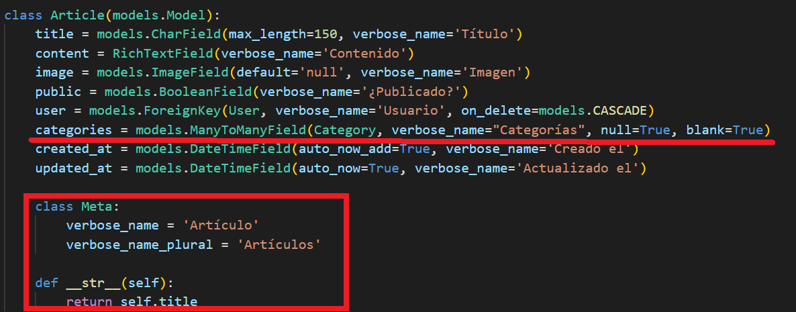

## Modelos y relaciones en Django

[Regresar](/CodingBootcampsESPOL-RDDW/)

Crear app para el blog
===========

* * *

Nuestro proyecto tendrá la sección de blog que tendrá artículos y categorías relacionadas. POr tal razón, se creará una nueva app con el siguiente comando.

```
python manage.py startapp blog
```

* Debemos agregar la app creada al archivo de settings.py.(RDDD-apps\django\ProyectoDjango\ProyectoDjango\settings.py)

<p align="center">

</p>

Crear modelo de categoría
===========

* * *

* En la app **blog** tendremos dos modelos que son para las categorías y para los artículos. En el archivo models.py(RDDD-apps\django\ProyectoDjango\blog\models.py) estaremos creando los modelos.

```py
class Category(models.Model):
    name = models.CharField(max_length=100, verbose_name='Nombre')
    description = models.CharField(max_length=255, verbose_name='Descripción')
    created_at = models.DateTimeField(auto_now_add=True, verbose_name='Creado el')

    class Meta:
        verbose_name = 'Categoría'
        verbose_name_plural = 'Categorías'

    def __str__(self):
        return self.name
```

Crear modelo Artículo
===========

* * *

* En el archivo models.py(RDDD-apps\django\ProyectoDjango\blog\models.py) se estará  creando el modelo para los artículos.

```py
from ckeditor.fields import RichTextField
class Article(models.Model):
    title = models.CharField(max_length=150, verbose_name='Título')
    content = RichTextField(verbose_name='Contenido')
    image = models.ImageField(default='null', verbose_name='Imagen')
    public = models.BooleanField(verbose_name='¿Publicado?')
    created_at = models.DateTimeField(auto_now_add=True, verbose_name='Creado el')
    updated_at = models.DateTimeField(auto_now=True, verbose_name='Actualizado el')
```

Relaciones entre los modelos
===========

* * *

Django ya nos ofrece el modelo de usuario con el que estaremos trabajando para hacer las relaciones.

* En el archivo models.py importaremos el modelo **User** al inicio del archivo.

```py
from django.contrib.auth.models import User
```

* Dentro de la clase **Article** definiremos un nuevo atributo para que en la base de datos guarde el id del usuario que ha creado dicho artículo.

<p align="center">

</p>

* Ahora crearemos una nueva relación ya que un artículo está asociado a una categoría. Pero, en este caso ejemplicaremos una relación de muchos a muchos. Además de crear la clase Meta y el método para imprimir.

<p align="center">

</p>

Crear migraciones para los modelos relacionados
===========

* * *

* Para empezar a hacer las migraciones abriremos la consola y ejecutamos el siguiente comando:

```
python manage.py makemigrations 
```

<p align="center">

</p>

* Ahora ejecUtamos el comando para generar el código sql.

```
python manage.py sqlmigrate blog 0001
```

* Para realizar los cambios en la base de datos ejecuta el siguiente comando:

```
python manage.py migrate
```

* La comprobación de que las tablas fueron creadas las verificaremos mediante el programa **DB Browser for SQLite**. Abre la base de datos que se encuentra dentro de la subcarpeta AprendiendoDjango.

<p align="center">

</p>