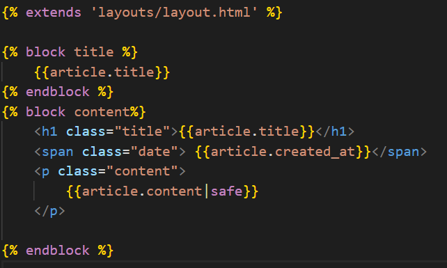
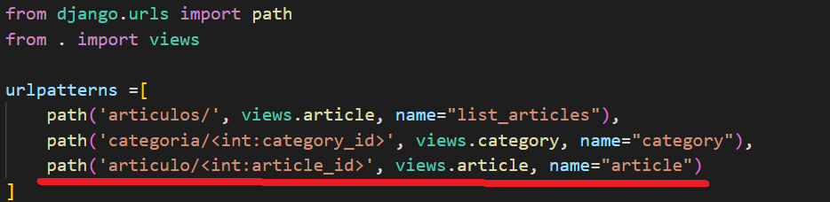
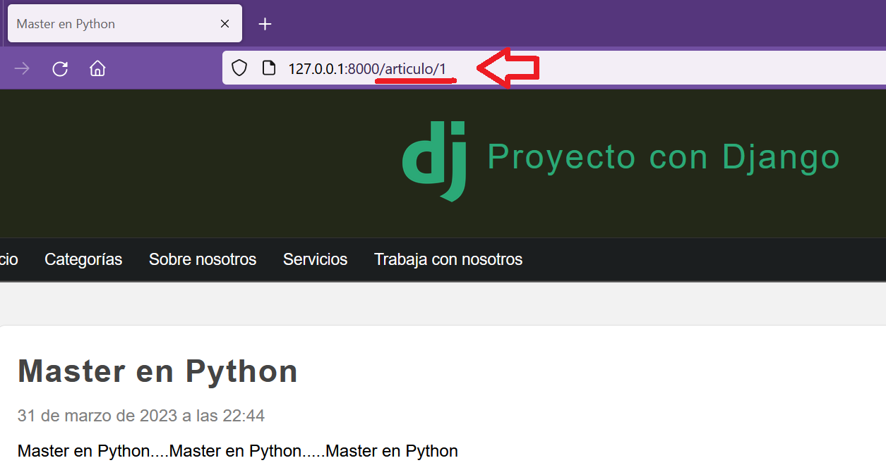
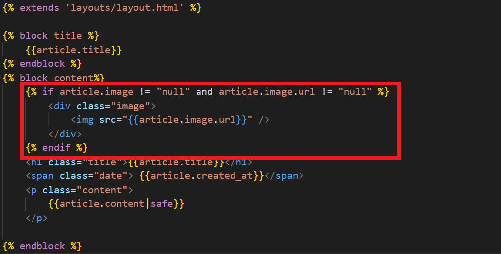
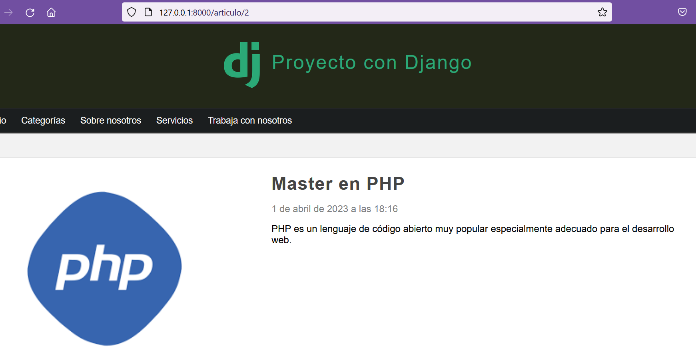

## Página para cada artículo

[Regresar](/CodingBootcampsESPOL-RDDW/)

En el archivo view.py(django\ProyectoDjango\blog\views.py) crearemos una nueva función para mostrar una página por cada artículo.

```py
def article(request, article_id):
    article = get_object_or_404(Article, id=article_id)
    return render(request, 'articles/details.html', {
        'article' : article
    })
```

* En la carpeta **articles** crea el archivo details.html.

<p align="center">

</p>

* Es momento de crear una ruta para la template de detail esto se realizará en el archivo urls.py.

<p align="center">

</p>

* En el navegador accede a uno de las artículos que tengas creado.

<p align="center">

</p>

Cargar imagenes en los artículos
===========

* * *

* En el archivo details.html(django\ProyectoDjango\blog\templates\articles\details.html) agregaremos el código para cargar imagenes.

<p align="center">

</p>

* Actualiza o accede a la url correspondiente y visualizarás la imagen del artículo.

<p align="center">

</p>
