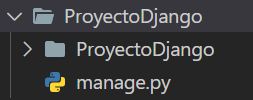
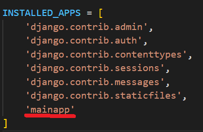
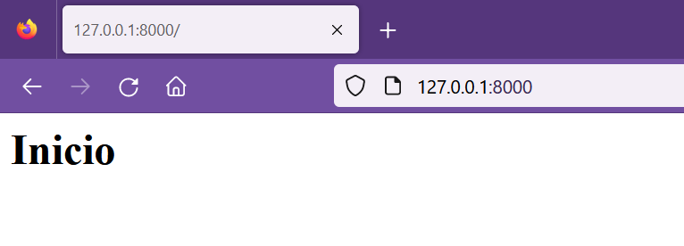
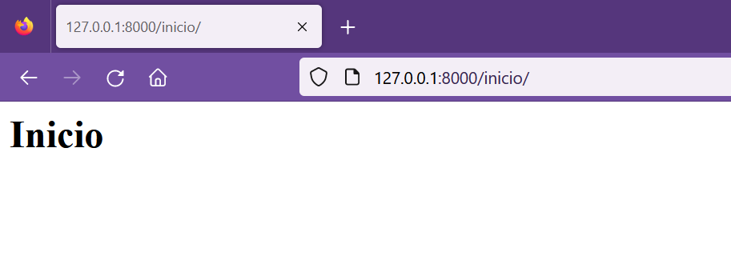
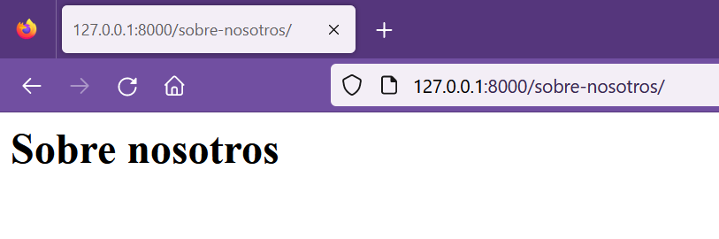
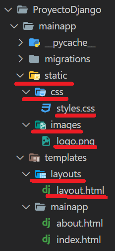
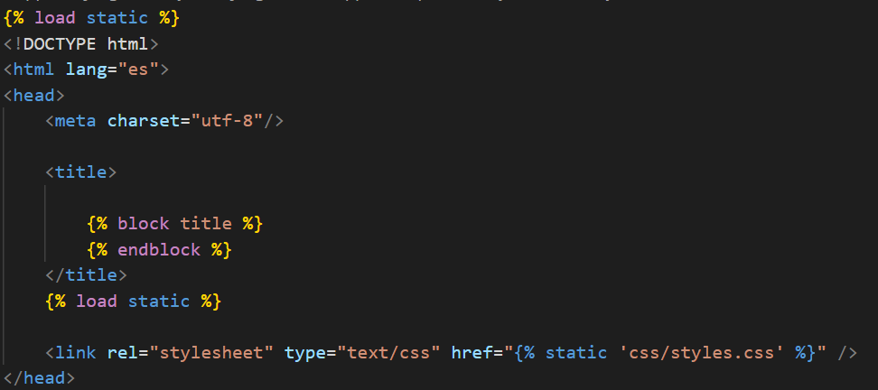
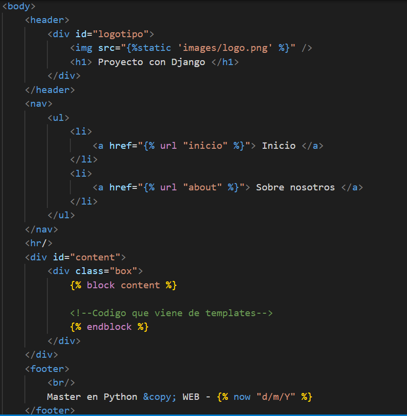
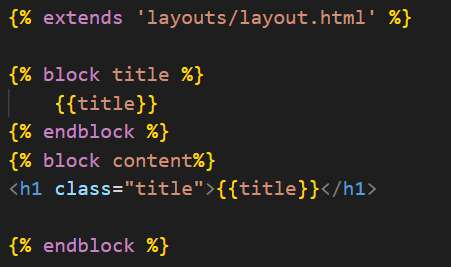

## Proyecto de Django

[Regresar](/CodingBootcampsESPOL-RDDW/)

Para continuar con la sección de **sistema de páginas** debemos volver a configurar un nuevo proyecto en django para que de forma limpia y organizada se comprenda los conceptos relacionados a sistema de páginas.

* Recordemos que al inicio del curso habiamos creado la carpeta principal con el nombre de RDDD-apps y a su vez contenia la subcarpeta django. Por tal razón, abre la consola y dirigite a dicha ruta en la que deberás ejecutar el siguiente comando.

```
django-admin startproject ProyectoDjango
```
<p align="center">

</p>

* Como se visualiza en la imagen anterior, en tu editor de texto se reflejará que se ha creado la carpeta ProyectoDjango.

* Ahora realizarás una configuración al idioma español. Debes abrir el archivo **settings.py** de la subcarpeta ProyectoDjango. Y en la variable LANGUAJE_CODE colocarle **es-es**.

* Finalmente, verificaremos el correcto funcionamiento de nuetsro proyecto web. En la consola dirigite a la carpeta ProyectoDjango en la que ejecutarás el comando:

```
python manage.py runserver
```
* La ejecución anterior nos dice que nuetsro servidor está en el puerto 8000, accede mediante la url al [ProyectoDjango](http://127.0.0.1:8000/).

Crear app principal del proyecto
===========

* * *

* Con el siguiente comando crearemos la app principal de nuetsro proyecto en Django.

```
python manage.py startapp mainapp
```

Crear vistas, urls y templates
===========

* * *

* Empezamos añadiendo la **mainapp** creada anteriormente a la lista de INSTALLED_APPS del archivo settings.py que se encuentra en la subcarpeta ProyectoDjango.

<p align="center">

</p>

* Para este proyecto haremos uso de templates por tal razón, dentro de la carpeta mainapp crear la carpeta **templates** y dentro de ella crear las carpetas **layouts** y **mainapp**.

* En la carpeta **mainapp** se encuentra el archivo views.py en donde crearemos nuestras vistas.

```py
def index(request):
    return render(request, 'mainapp/index.html', {
        'title': 'Inicio'
    })

def about(request):
    return render(request, 'mainapp/about.html', {
        'title': 'Sobre nosotros'
    })
```

* En la subcarpeta mainapp que se encuentra en la carpeta templates crear los archivo index.html y about.html. (ProyectoDjango>mainapp>templates>mainapp>index.html)

```html
<h1>{{title}}</h1>
```

* Ahora configurarás una url en el archivo urls.py. (ProyectoDjango>ProyectoDjango>urls.py)

```py
from django.contrib import admin
from django.urls import path
from mainapp import views

urlpatterns = [
    path('admin/', admin.site.urls),
    path('', views.index, name="index" ),
    path('inicio/', views.index, name="inicio" ),
    path('sobre-nosotros/', views.about, name="about")
]
```

<p align="center">

</p>

<p align="center">

</p>

<p align="center">

</p>


Estilos al proyecto
===========

* * *

* A continuación se presentará el contenido de cada archivo para darle estilo al proyecto. En la siguiente notarás las carpetas y archivos que debes crear.

<p align="center">

</p>

* El archivo styles.css contiene las siguientes líneas de código.

```css
/* Archivo styles.css*/
/* Estilos generales */

*{
    margin: 0px;
    padding: 0px;
    font-family: Arial, Helvetica, sans-serif;
    text-decoration: none;
}

body{
    background-color: #f2f2f2;
}

header{
    width: 1212px;
    height: 140px;
    background-color: #232818;
    margin: 0px auto;
}

#logotipo{
    width: 35%;
    height: 130px;
    margin: 0 auto;
    padding-top: 10px;
}

#logotipo img{
    display: block;
    width: 60px;
    float: left;
    margin-top: 20px;
}

#logotipo h1{
    display: block;
    float: left;
    margin-top: 35px;
    margin-left: 20px;
    letter-spacing: 2px;
    font-weight: 100;
    color: #2ba977;
}

nav{
    width: 1250px;
    height: 40px;
    margin: 0 auto;
    background-color: #1B1E1F;
    border: 1px solid #333333;
    box-shadow: 0px 22px 22px gary;
    font-size: 15px;
    
}

nav ul{
    list-style: none;
    text-decoration: none;
}

nav ul li{
    line-height: 40px;
    float: left;
}

nav ul li a{
    display: block;
    padding-left: 15px;
    padding-right: 10px;
    color: white;
}


nav ul li a:hover{
    background: #2ba977;
    box-shadow: 0px 0px 5px #333333 inset;
    transition: all 300ms;
}

#content{
    width: 1212px;
    min-height: 930px;
    margin: 0 auto;
    margin-bottom: 30px;
    margin-top: 40px;
}

.box{
    background: white;
    width: 95%;
    min-height: 930px;
    padding: 20px;
    border: 1px solid #ddd;
    border-radius: 10px;
    margin: 0 auto;
}

.title{
    color: #444;
    letter-spacing: 1px;
    font-size: 30px;
    margin-bottom: 10px;
    margin-top: 5px;
}

footer{
    width: 1250px;
    background-color: #1B1E1F;
    border: 1px solid #333;
    color: #d1d4d6;
    text-align: center;
    margin: 0 auto;
    padding-top: 20px;
    padding-bottom: 20px;
    box-shadow: 0px 0px 20px gray;
}

```
* El archivo layout.html contiene las siguientes líneas de código.

<p align="center">

</p>

<p align="center">

</p>

* El logo de Djnago puedes buscarla en el navegador y descargarla.

* Ahora los archivos about.html y index.html tendrán la siguiente estructura.

<p align="center">

</p>

* Ejecuta el servidor y visualiza los nuevos estilos que tendrá tu proyecto.