## Login de usuario

[Regresar](/CodingBootcampsESPOL-RDDW/)

* Para la parte del login añadiremos una nueva función en el archivo de views.py(django\ProyectoDjango\mainapp\views.py).

```py
def login_page(request):
    return render(request, 'users/login.html', {
        'title': 'Identificate'
    })
```

* En la carpeta de templates dentro de users crea el archivo login.html(django\ProyectoDjango\mainapp\templates\users\login.html).

<p align="center">
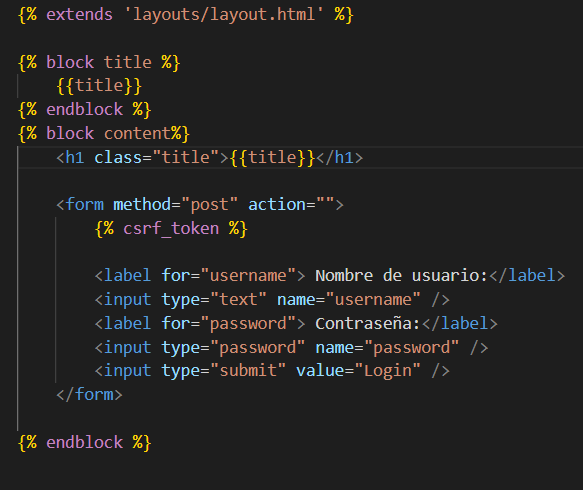
</p>

* Crearemos una nuevo ruta en el archivo de urls.py(django\ProyectoDjango\mainapp\urls.py) de la mainapp.

```py
urlpatterns =[
    path('', views.index, name="index"),
    path('inicio/', views.index, name="inicio"),
    path('registro/', views.register_page, name="register"),
    path('login/', views.login_page, name="index"),
]
```

* En el template de layout.html(django\ProyectoDjango\mainapp\templates\layouts\layout.html) agregaremos una nueva opción en el menú de navegación. 

<p align="center">
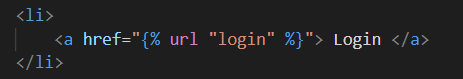
</p>

* Ejecuta el servidor y accede a la [página de login](http://127.0.0.1:8000/login/), en donde visualizarás el formulario para ingresar.


Login de usuarios
===========

* * *

* Usando el módulo de autenticación realiaremos el login de usuarios. En el archivo views.py(django\ProyectoDjango\mainapp\views.py).

<p align="center">
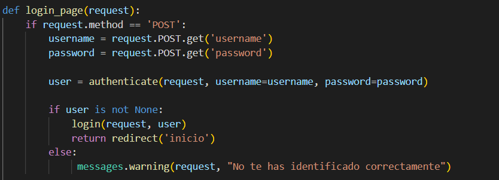
</p>

* En el archivo de login.html(django\ProyectoDjango\mainapp\templates\users\login.html) añadiremos un mensaje de warning.

<p align="center">
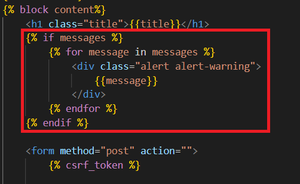
</p>

* Ejecuta el servidor y verifica el acceso correcto e incorrecto.

<p align="center">
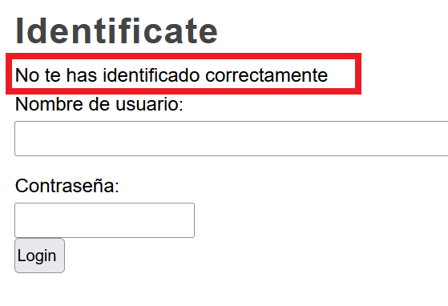
</p>

<p align="center">
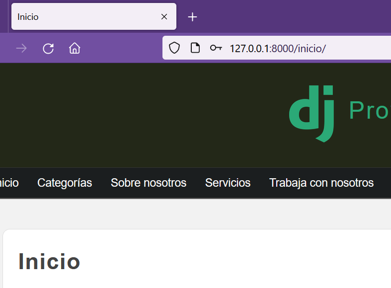
</p>

Mostrar usuario identificado
===========

* * *

* En el archivo de index.html realizaremos la validación de un usuario autenticado.

<p align="center">
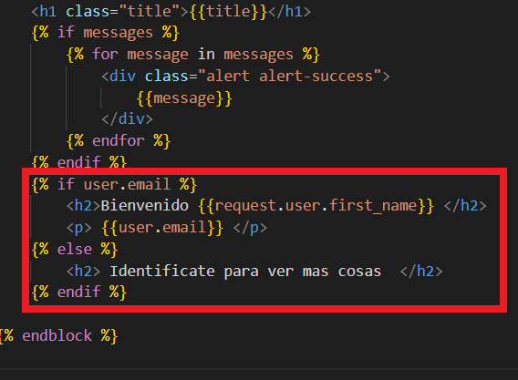
</p>

*  Ejecuta el servidor y cierra sesión. Refresca el inicio y visualizaras el texto correspondiente.

<p align="center">
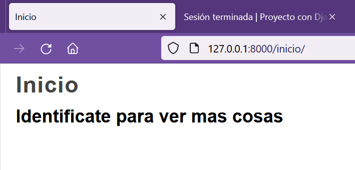
</p>

* Haz login con el usuario correspondiente y verifica los cambios.

<p align="center">
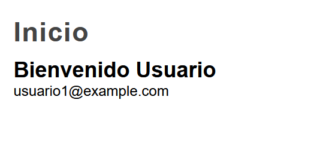
</p>

* En el caso de que no estar autenticado. No deben mostrarse ciertos campos del menú de navegación. En el template de layout.html(django\ProyectoDjango\mainapp\templates\layouts\layout.html) agregaremos la modificación.

<p align="center">
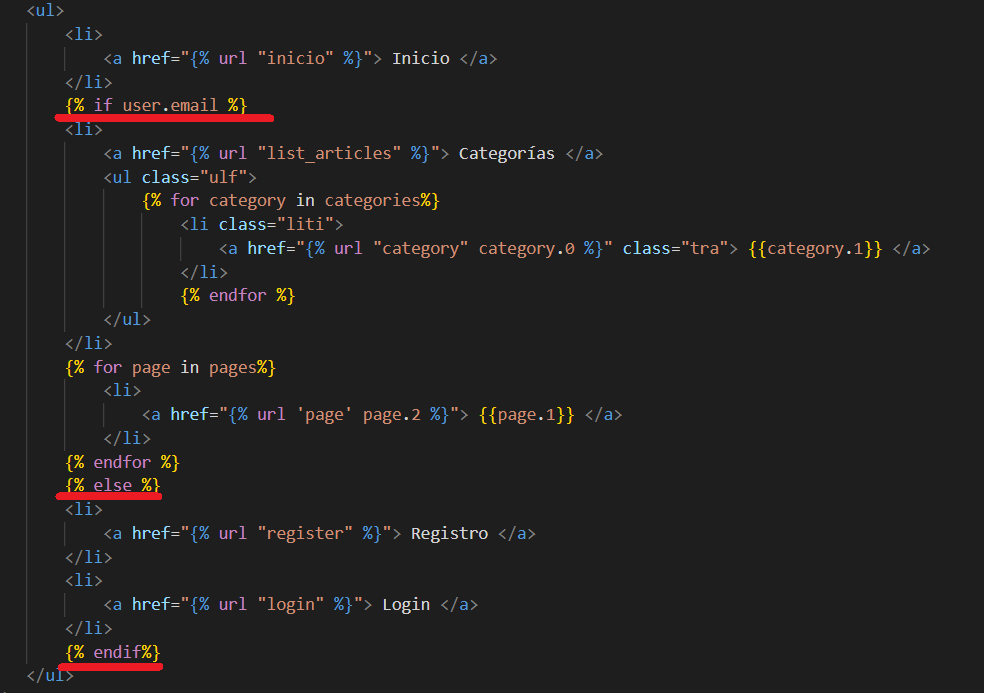
</p>

* En el navegador actualiza el sitio y observa la modificación en el menú de navegación.

<p align="center">
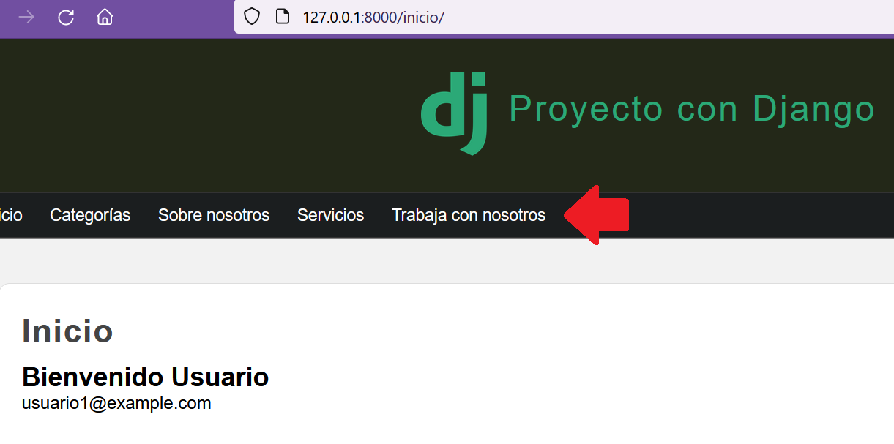
</p>

Cerrar sesión y restringir el acceso
===========

* * *

* Para gestionar el cierre de sesión crearemos una nueva función en el archivo de views.py(django\ProyectoDjango\mainapp\templates\users\login.html). 

* Añadiremos la ruta del logout en el archivo de urls.py(django\ProyectoDjango\mainapp\urls.py).

<p align="center">
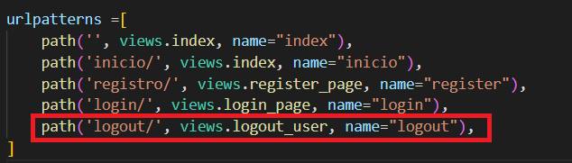
</p>

* En el template de layout.html añadiremos una nueva opción en el panel de administración que representará el cierre de sesión.

<p align="center">
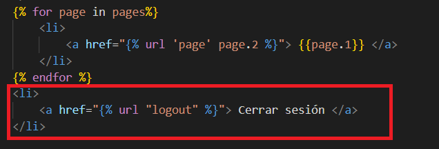
</p>

* Ejecuta el servidor y visualizarás la opción de cerrar sesión.

<p align="center">
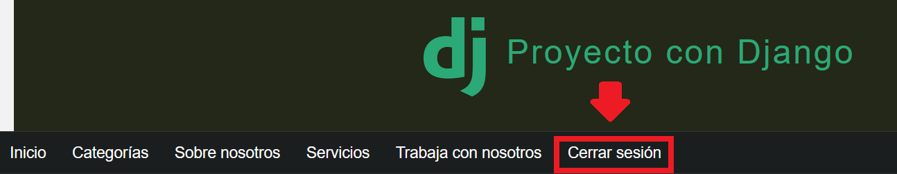
</p>

* Para restringir el acceso usaremos los decoradores de Django. Un decorador es una función que recibe como parámetro una función y que retorna otra función. Esto lo utilizamos para alterar el comportamiento de una función sin tener que modificar su código.

<p align="center">
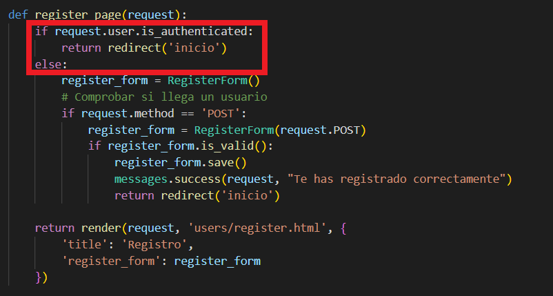
</p>

<p align="center">
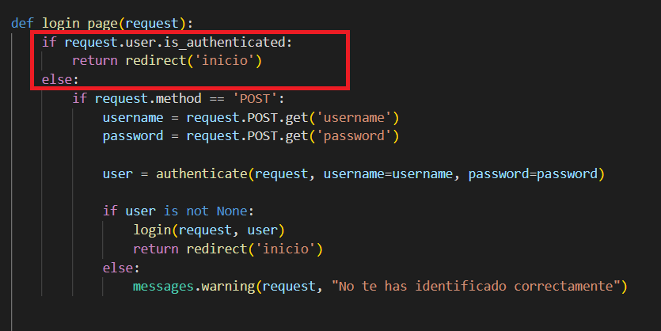
</p>