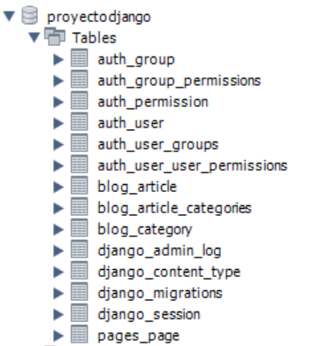

## MySQL en Django

[Regresar](/CodingBootcampsESPOL-RDDW/)

* Para esta sección estaremos trabajando con MySQL Workbench. Accedes con tu usuario y contraseña respectiva. Creamos una nueva base de datos con el nombre de proyectodjango.

<p align="center">

</p>

* Vamos a configurar la base de datos que habiamos creado, en el archivo de settings.py(django\ProyectoDjango\ProyectoDjango\settings.py) y buscaremos la sección de **DATABASES**. Deberás añadirle el user, password y puerto que tengas configurado en tu MySQL Workbench.

<p align="center">

</p>

* Ahora instalaremos un driver para hacer la conexión entre mysql y Django. Ejecuta el siguiente comando en la consola ubicandote en la ruta del ProyectoDjango.

```
pip install mysqlclient
```

* Ahora ejecutaremos las migraciones utilizando el siguiente comando.

```
python manage.py migrate
```
<p align="center">

</p>

* Verificamos en el MySQL Workbench la migración y visualizaremos las tablas y todo lo que se encontraba en nuestros modelos ya definidos. Tenedremos todo la estructura de nuestra base de datos.

<p align="center">

</p>

* Creamos un superusuario ejecutando el siguiente comando:

```
python manage.py createsuperuser
```

* Ejecutamos el servidor de nuestro proyecto y verificamos que funciona correctamente. Accedes a la [página del administrador](http://127.0.0.1:8000/admin/).

```
python manage.py runserver
```

<p align="center">

</p>

* Añadimos una nueva categoría desde el panel de administración.

<p align="center">

</p>

* Actualizamos la base de datos en MySQL Workbench y visualizaremos la tabla de **blog_category** que tendrá la categoría de programación recién creada.

<p align="center">

</p>