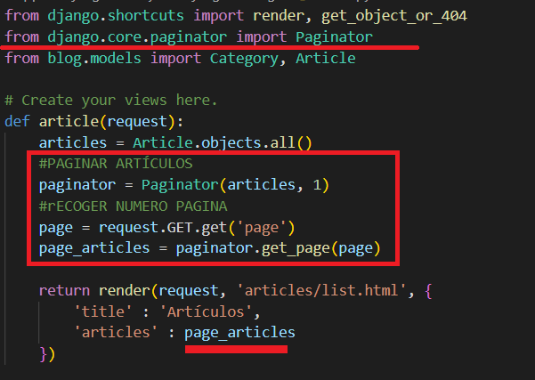
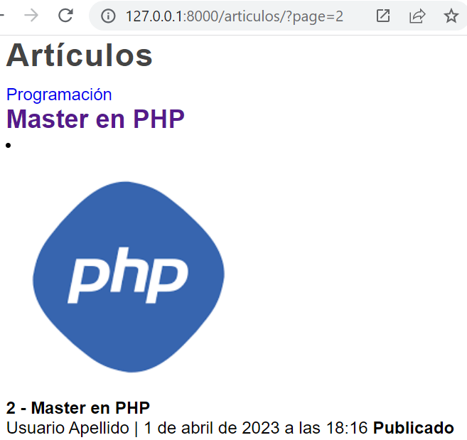
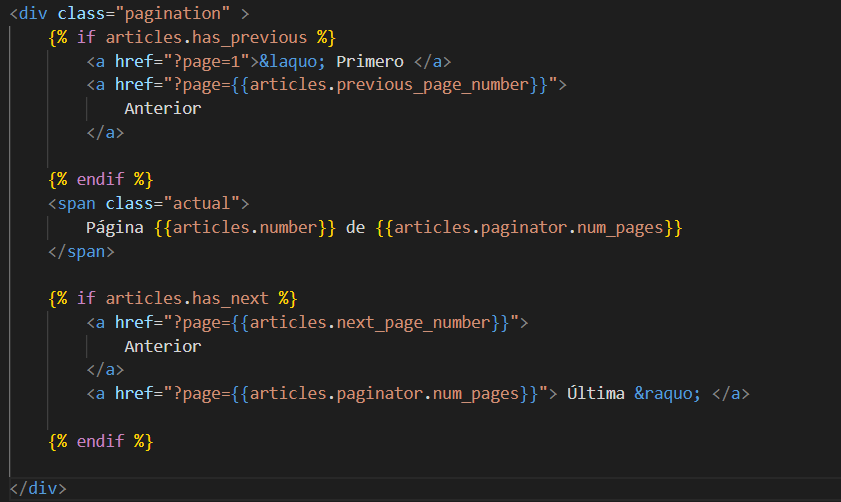
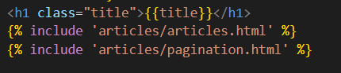
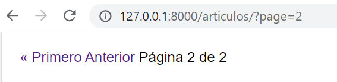

## Paginación en Django

[Regresar](/CodingBootcampsESPOL-RDDW/)

La Paginación en django es excelente, permite una flexibilidad importante para solucionar muchos problemas que se presentan al paginar resultados.

* En el archivo views.py(django\ProyectoDjango\blog\views.py) de la app blog para que en la sección de artículos nos muestre 1 artículo por página.

* Actualiza el servidor y accede a las distintas páginas para los artículos. En este aso, configuramos para que se muestre 1 página por artículo.

* Para la navegación de la paginación, agregamos un archivo pagination.html(django\ProyectoDjango\blog\templates\articles\pagination.html) con el siguiente código.

* En el archivo de list.html(django\ProyectoDjango\blog\templates\articles\list.html) debes incluir el archivo de paginación.

* Actualiza el navegador y visualiza los cambios.

