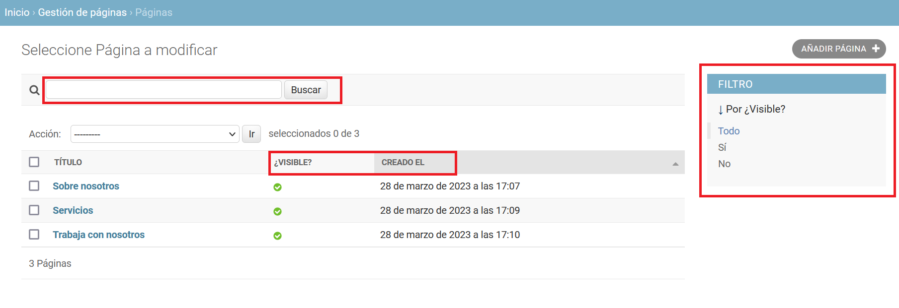
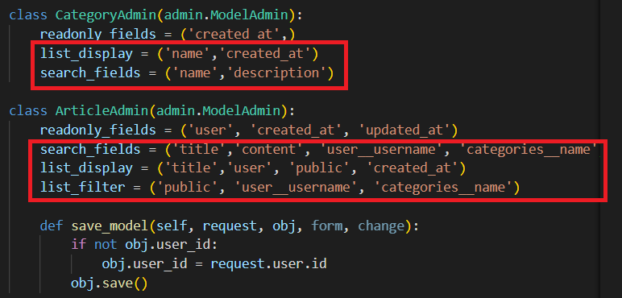

## Personalizar listados

[Regresar](/CodingBootcampsESPOL-RDDW/)

En la app pages personalizaremos el panel de administración, agregando una nueva configuración en el archivo admin.py(django\ProyectoDjango\pages\admin.py). Se configurarón las variables que son de lectura, se agregará un buscador y además agregaremos un filtro para las páginas que se encunetran visibles.

```py
# Configuración extra

class PageAdmin(admin.ModelAdmin):
    readonly_fields = ("created_at", "updated_at")
    search_fields = ("title", "content")
    list_filter = ('visible',)
    list_display = ('title', 'visible', 'created_at')
    ordering = ('created_at',)

# Register your models here.
admin.site.register(Page, PageAdmin)
```

<p align="center">

</p>

* Para las categorías realizaremos una configuración similar en el archivo admin.py de la app blog(django\ProyectoDjango\blog\admin.py). Y en los artículos también tendrá cambios.

<p align="center">

</p>