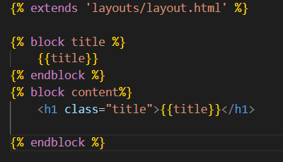
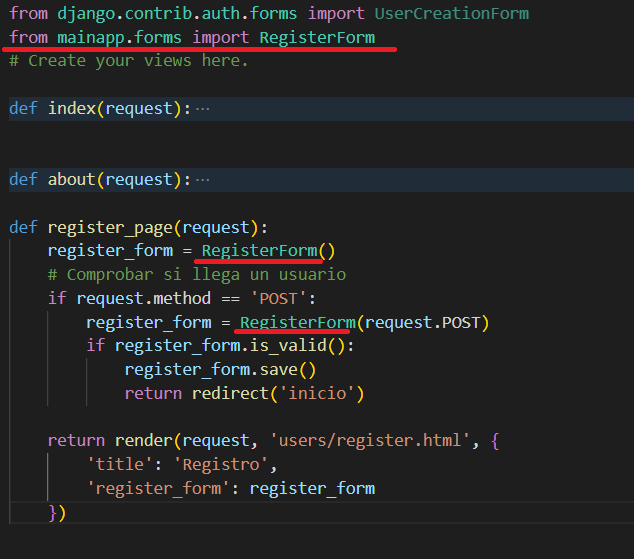

## Registro de usuario

[Regresar](/CodingBootcampsESPOL-RDDW/)


El tema de registro es parte de la autenticación de nuestra página web, con los componentes de Django implemnetaremos el registro.

* Dentro de mainapp se encuentra el archivo views.py(django\ProyectoDjango\mainapp\views.py) en que agregaremos una nueva función para el registro.

```py
def register_page(request):
    return render(request, 'users/register.html', {
        'title': 'Registro'
    })
```

* Dentro de la carepta template de mainapp crea una subcarpeta **users** y de ahí crea el archivo register.html(django\ProyectoDjango\mainapp\templates\users\register.html).

<p align="center">

</p>

* Añadimos la url al archivo de urls.py(django\ProyectoDjango\mainapp\urls.py).

```py
urlpatterns =[
    path('', views.index, name="index"),
    path('inicio/', views.index, name="inicio"),
    path('registro/', views.register_page, name="register"),
]
```
* En el archivo layout.html(django\ProyectoDjango\mainapp\templates\layouts\layout.html) agregaremos un nuevo elemento para el registro.

<p align="center">

</p>

* Ejecutamos el servidor y visualizamos que en el aprece en la barra de navegación el nuevo elemento que es **Registro**.

<p align="center">

</p>

Formulario de registro de usuario
===========

* * *

* Seguiremos trabajando en el archivo de views.py(django\ProyectoDjango\mainapp\views.py) importando el modulo de autenticación, y en la vista de register_page cargaremos el formulario.


```py
from django.shortcuts import render, redirect
from django.contrib.auth.forms import UserCreationForm
def register_page(request):
    register_form = UserCreationForm()
    # Comprobar si llega un usuario
    if request.method == 'POST':
        register_form = UserCreationForm(request.POST)
        if register_form.is_valid():
            register_form.save()
            return redirect('inicio')
    
    return render(request, 'users/register.html', {
        'title': 'Registro',
        'register_form': register_form
})

```

* Ahora mostraremos el formulario en el template de register.html.

<p align="center">

</p>

* En la página de [registro](http://127.0.0.1:8000/registro/), registra un nuevo usuario y contraseña.

<p align="center">

</p>

Formulario de registro personalizado
===========

* * *


Para personalizar nuestro formulario nos basaremos en el formulario por defecto que visualizamos usando el UserCreationForm.

* En la app mainapp creamos un nuevo archivo forms.py(django\ProyectoDjango\mainapp\forms.py).

```py
from django import forms
from django.core import validators

from django.contrib.auth.forms import UserCreationForm
from django.contrib.auth.models import User

class RegisterForm(UserCreationForm):
    class Meta:
        model = User
        fields = ['username', 'email', 'first_name', 'last_name', 'password1', 'password2']
```

* Ahora debemos pasarle a la vista de register_page el formulario que hemos creado, realiza la siguiente modificación en el archivo views.py(django\ProyectoDjango\mainapp\views.py).

<p align="center">

</p>

* Modificaremos también el archivo register.html para que se muestre los campos y sus respectivos labels.

<p align="center">

</p>

* Verifica que el servidor se encuentre en ejecución, y accede a la página de registro y envia un formulario de registro.

<p align="center">

</p>

* Accede al panel de administración, en la sección de usuario visualizarás que ahí se encuentra el usuario que registraste en el formulario.

<p align="center">

</p>

Mensaje flash en el registro
===========

* * *

Crearemos un mensaj flash cuando el usuario se haya registrado en el formulario.

* En el archivo views.py(django\ProyectoDjango\mainapp\views.py) agregaremos lo del mensaje flash en la función de register_page.

<p align="center">

</p>

* En el template de index.html(django\ProyectoDjango\mainapp\templates\mainapp\index.html) mostraremos el mensaje flash ya que cuando el usuario se registra lo redirige al index.

<p align="center">

</p>

* Registra un nuevo usuario y visualiza el mensaje flash.

<p align="center">

</p>

* Puedes darle estilo a la clase message y alert-success en el archivo styles.css(django\ProyectoDjango\mainapp\static\css\styles.css).

```css
.message,
.alert-success{
    padding: 20px;
    background: #1f7e58;
    color: white;
    text-align: center;
    margin-bottom: 10px;
}
```